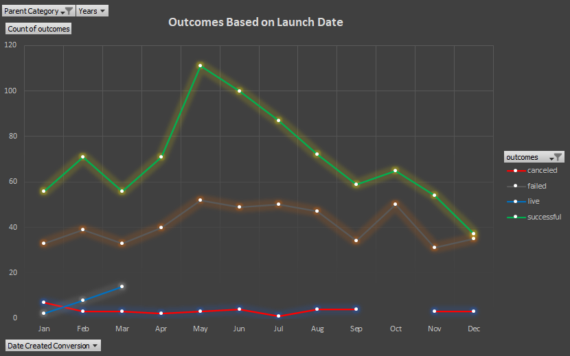

# Kickstarter Analysis and Trends
Showing our dear friend Louise trends and insights from various types of Kickstarters in order to help her kickstart her own theatre campaign. 

#### Outcomes Based on Theatre Category

#### Outcomes Based on Launch Date

#### Recommendation
Louise should strongly start her Theatre Play Campaign in the Months of May-June-July, and should seek to lower her campaign goal of $10,000.

### Challenge

Having Louise's play *Fever* come close to fruition, I decided to analyze similar plays with various outcomes and launch dates. After analyzing some the data, few conclusions can be drawn.

#### Outcomes based on Goals

Reaching a campaign goal from pledges is just one factor of a successful campaign. There is approximately 50% chance for theatre plays to be successful if the Campaign goal is less than $20,000. However, the success percentage increases as one lowers the Campaign goal. For example, if the Campaign goal is $5000, the percentage increases to about 60%. It can further increase to about 75% if the Campaign goal is in the range of $1000. Hence, a theatre play campaign might have a higher chance for becoming a success if it keeps its campaign goals as limited as possible. Consequently, the higher the campaign goal, such as $25,000 or above, the higher the chances of one becoming a failed campaign. 

#### Outcomes based on Launch Date

After looking at raw data for when Campaigns were created and ended, there seems to be a trend for successful campaigns in the months of May-June-July, and lower success rates falling in Jan-Feb and Aug-Sep-Oct, with the lowest rates in December. Therefore, one might consider starting a theatre campaign in Summertime as that suggests the highest success rate over other times of the year.

#### Limitations

Although the Kickstarter dataset provided unique trends and valuable insights, there were some limitations that restricted deeper analyses. Perhaps one limitation could be lack of recent data, since the most recent campaign was in 2017. Recent data can help better uncover certain trends in types of successful Kickstarter data currently. In addition, more data in the parent category *theatre* and subcategory *plays* would portray a stronger outcome prediction, and maybe even distinctions in the *plays* category such as comedies, tragedies would highlight specific traction towards types of plays that tend to garner more attention/donations. Furthermore, more raw data from different sites such as IndieGoGo would also help make stronger analyses because with data, the more the merrier. Another factor could be a specific dataset ascertaining the amount of social outreach a campaign does, such as number of ads, tweets, which might imply higher success rates for those campaigns that reached out more. 

#### Suggestions

A few suggestions could be made to attempt to understand the data more. One could be comparing *staff picks* and/or *spotlight* to successful outcomes. Could the relation of staff picks and spotlight have an affect one a campaign becoming successful? Or is that relationship independent of a successful campaign? Another suggestion regarding the distribution spread of *backers count* would highlight a certain trend for successful and failed outcomes, such as a certain range of number of backers might portray a higher percentage of a campaign to be successful.
